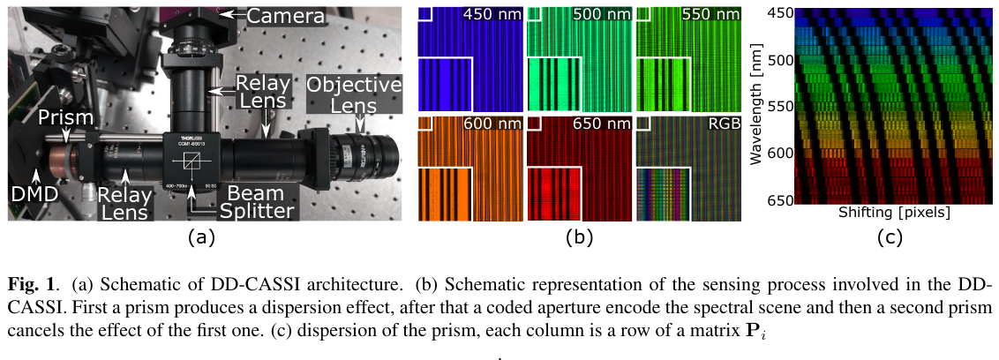

# ICIPCovariance
Algorithm to reconstruct hyperspectral images from compressive measurements using a low-rank approximation of the covariance matrix. This repository also provides data adquired in laboratory

This repository provides the source code to reconstruct images from compressive data captured with DD-CASSI architecture. The test bed optical implementation is shown

To run this code, first download the sensing matrix from [link], and unzip the folder False_8 into "codigos" folder. Then run format_sensing_matrix to set up the sensing matrix. After that run reconstruct to show the reconstruction results.

please cite us as : J. Monsalve, M. Marquez, I. Esnaola and H. Arguello, "Compressive Covariance Matrix Estimation from a Dual-Dispersive Coded Aperture Spectral Imager," 2021 IEEE International Conference on Image Processing (ICIP), 2021, pp. 2823-2827, doi: 10.1109/ICIP42928.2021.9506077.

[link]: https://drive.google.com/file/d/1zokOd3vMiIL-wWT25xJAgUIXhhDj2W4v/view?usp=sharing

